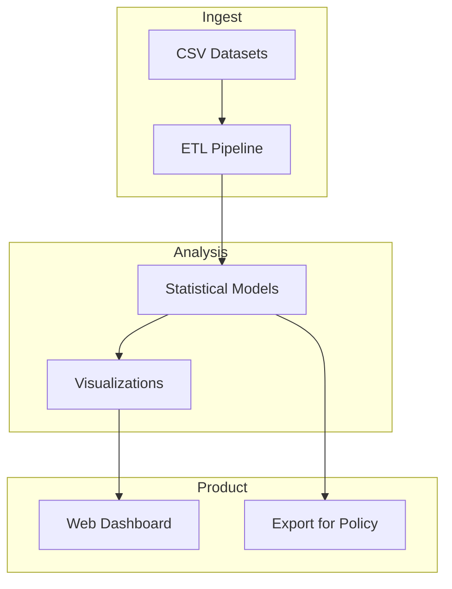

# Operationalization – Analyzing_NYC_High_School_Data

## System flow

## Target user, value proposition, deployment

**Target user:** Educators and policy. **Value proposition:** NYC school insights platform – compare schools, demographics, outcomes; export for funding or intervention planning. **Deployment:** Web dashboard and optional export (CSV/PDF).

## Next steps

1. **run.py:** Load CSVs, compute key metrics (e.g. AP participation by borough), output summary.
2. **Dashboard spec:** Define views and filters.
3. **Export for policy:** One-click report export.
