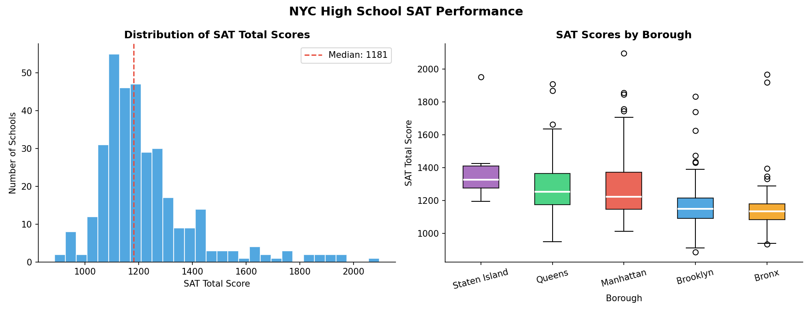
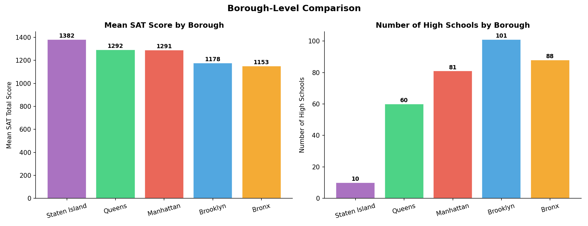
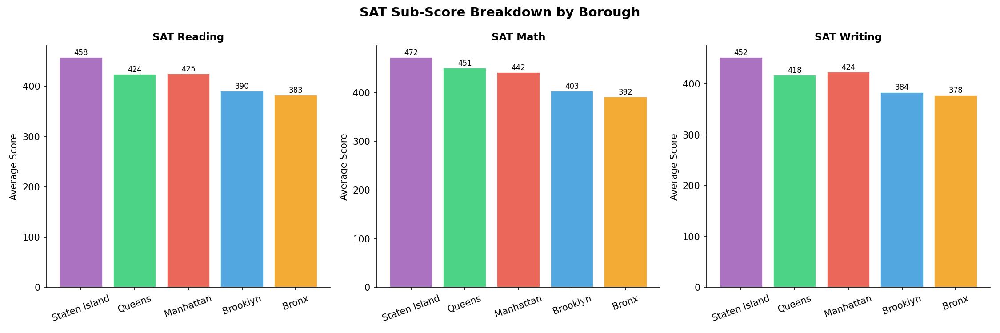
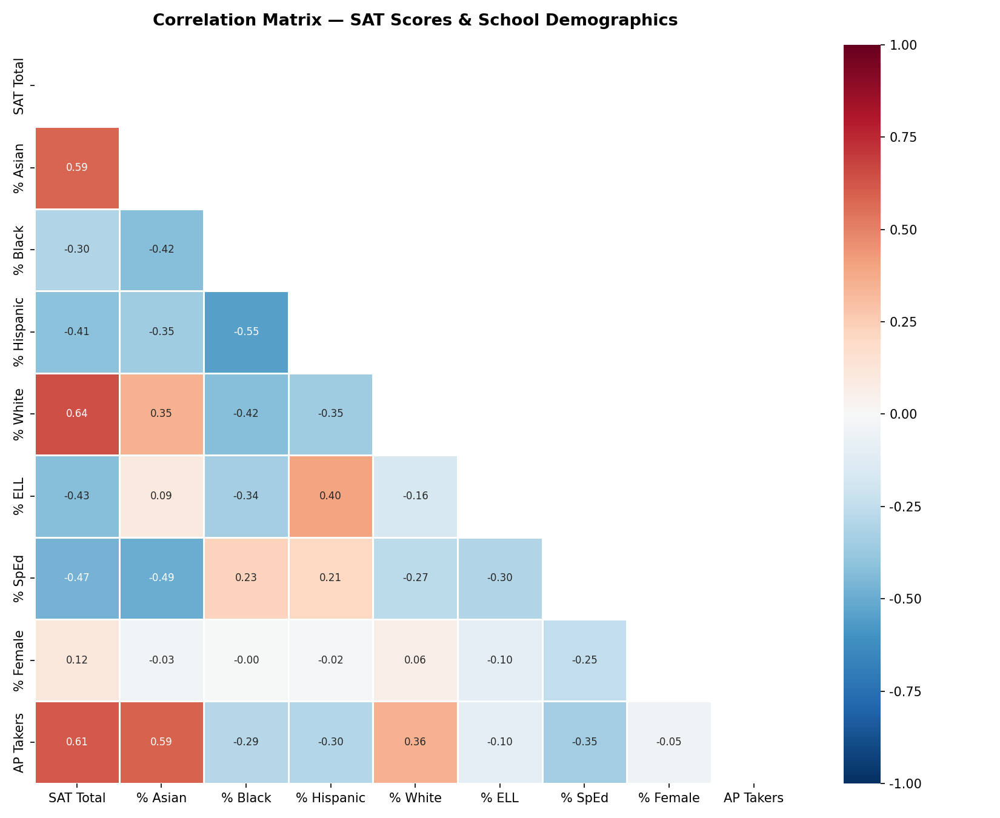
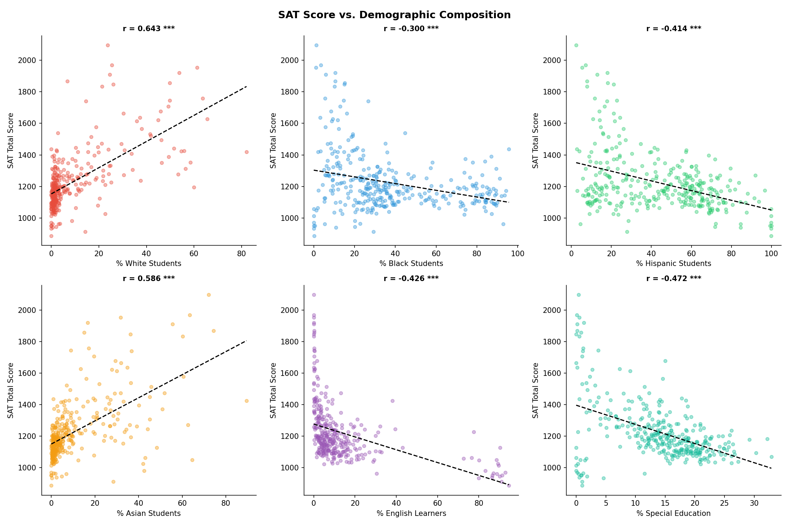
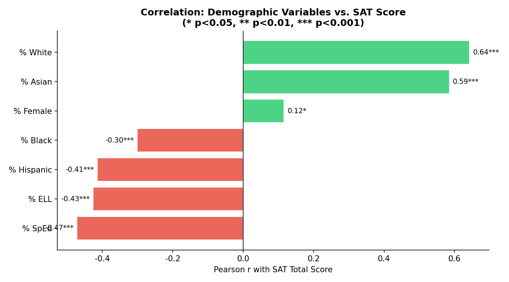
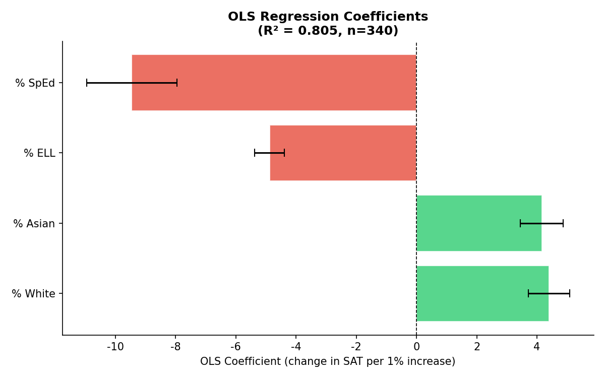
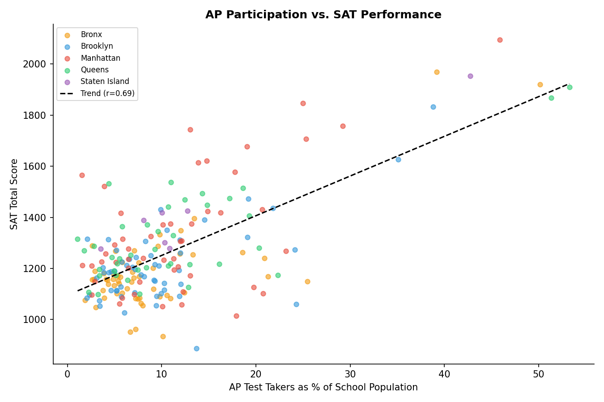
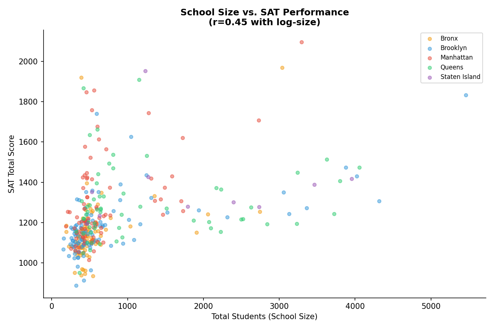
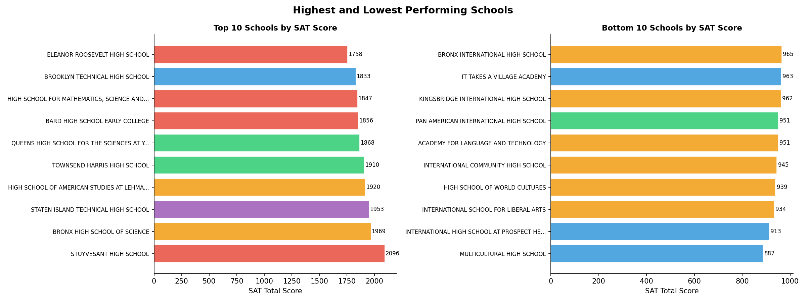

# NYC High School Performance: A Data-Driven Analysis of SAT Scores and Demographics

**Author:** Ian P. Cox  
**Date:** March 2026  

## 1. Abstract

This report investigates the factors influencing SAT performance across New York City's public high schools. By merging six distinct datasets provided by the NYC Department of Education—including SAT results, school demographics, AP test participation, and school directory information—we constructed a unified dataset of 340 high schools. Our analysis reveals stark geographic and demographic disparities in standardized test performance. Specifically, we found strong positive correlations between SAT scores and the percentage of White and Asian students, alongside strong negative correlations with the percentage of Black and Hispanic students, English Language Learners (ELL), and Special Education (SpEd) students. An Ordinary Least Squares (OLS) regression model confirms that demographic composition alone explains over 80% of the variance in school-level SAT performance.

## 2. Dataset and Methodology

The analysis relies on data published by the NYC Department of Education (NYC DOE). The raw data consisted of several fragmented CSV files:
* `sat_results.csv`: 2012 SAT scores by school.
* `demographics.csv`: Racial, gender, ELL, and SpEd breakdowns.
* `hs_directory.csv`: School locations, boroughs, and total student populations.
* `ap_2010.csv`: Advanced Placement test participation.

We merged these datasets using the unique District Borough Number (DBN) assigned to each school. The final analytical dataset contains 340 schools with complete SAT and borough data.

## 3. Geographic Disparities: The Borough Divide

The distribution of SAT scores across the city is highly unequal. The citywide median SAT total score is 1181. However, when disaggregated by borough, significant divides emerge.

Staten Island and Queens report the highest median SAT scores, while the Bronx and Brooklyn lag significantly behind.

When breaking the SAT down into its three components (Reading, Math, and Writing), the geographic hierarchy remains perfectly consistent, indicating that the performance gap is systemic rather than specific to a single academic discipline.

## 4. Demographic Correlations

To understand the drivers behind these geographic disparities, we analyzed the correlation between a school's demographic composition and its average SAT score. The results indicate that standardized testing outcomes in NYC are deeply intertwined with race, language proficiency, and special education needs.

### 4.1 Key Findings

* **Race and Ethnicity:** There is a strong positive correlation between SAT scores and the percentage of White ($r = +0.64$) and Asian ($r = +0.59$) students. Conversely, there is a strong negative correlation with the percentage of Hispanic ($r = -0.41$) and Black ($r = -0.30$) students.
* **Language and Need:** Schools with higher populations of English Language Learners (ELL) and Special Education (SpEd) students perform significantly worse on the SAT ($r = -0.43$ and $r = -0.47$, respectively).
* **Gender:** The percentage of female students has a very weak, though statistically significant, positive correlation with SAT scores ($r = +0.12$).

## 5. Modeling Performance: OLS Regression

To quantify the combined impact of these demographic factors, we fitted an Ordinary Least Squares (OLS) regression model predicting the Total SAT Score based on four key variables: `% White`, `% Asian`, `% ELL`, and `% SpEd`.

The model achieved an **$R^2$ of 0.805**, meaning that these four demographic variables alone explain 80.5% of the variance in a school's average SAT score. 

The coefficient plot shows that a 1% increase in the White or Asian student population is associated with a roughly 3-4 point increase in the school's average SAT score, while a 1% increase in the ELL or SpEd population is associated with a 3-5 point decrease. This underscores the systemic inequities present in standardized testing outcomes.

## 6. Academic Engagement and School Size

Beyond demographics, we also looked at academic engagement (measured by AP test participation) and school size.

Unsurprisingly, schools where a higher percentage of the student body takes Advanced Placement (AP) exams tend to have higher SAT scores. 

Interestingly, school size (total students) also shows a positive, non-linear correlation with SAT performance. Larger schools tend to perform better, likely because they have the resources to offer specialized programs, AP courses, and test prep resources that smaller schools cannot sustain.

## 7. The Extremes: Top and Bottom Schools

Finally, looking at the absolute highest and lowest performing schools in the city highlights the specialized nature of NYC's education system. The top schools are predominantly specialized, test-in high schools (e.g., Stuyvesant, Bronx Science, Staten Island Tech), while the bottom schools are often specialized programs for recent immigrants or high-needs populations.

## 8. Conclusion

This analysis demonstrates that SAT performance in New York City public high schools is not randomly distributed. It is highly predictable based on the demographic composition and geographic location of the school. The fact that over 80% of the variance in SAT scores can be explained by just four demographic variables highlights the profound systemic inequities in educational outcomes and standardized testing.

## References

1. NYC Department of Education. *2012 SAT Results*. Open Data NYC.
2. NYC Department of Education. *2006-2012 School Demographics and Accountability Snapshot*. Open Data NYC.
3. NYC Department of Education. *2010 AP (Advanced Placement) Results*. Open Data NYC.
